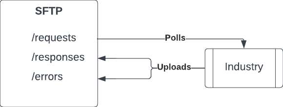

# Energy registrations

## Background

The energy industry communicates using data flows (essentially CSV files) via an SFTP server. It is fundamentally a request-response pattern.

To make a `Request` - upload a file to the `/requests` directory. (The _industry_ polls this directory every 10 minutes for new files which are immediately processed and deleted.)

To get a `Response` - Scan the /responses directory.

## Task

As a supplier, UW needs to send a request to take over new supplies by sending a "Registration" data flow to the industry.
We want to create an abstraction for this "Registration" data flow where a _client_ can submit a single registration, and be notified of the changes to the registration without having to understand the intricacies of the energy industry.

### Notes
- Each row in the data flow corresponds to a single registration and is identified by the `registration_id`
- Files names are a 6 digit sequential numbers `000001.CSV`, `000002.CSV` - you must not use the same number twice, and you must not upload a smaller number than the previous one
- There is no time limit on how quickly a response file for a request will be provided
- Files which contain errors are exposed in the `/errors` directory - If a `Request` file contained an error, a `Response` file will not be provided.
